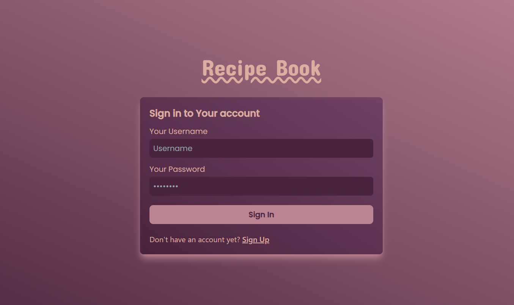
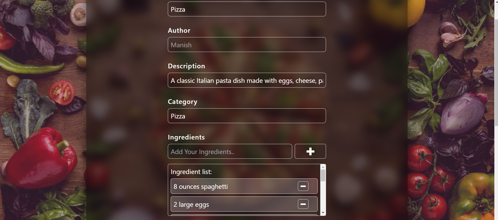

# RecipeBook

This project was generated with [Angular CLI](https://github.com/angular/angular-cli) version 17.2.3.

## Development server

Run `npm run dev` for a dev server. Navigate to `http://localhost:4200/`. The application will automatically reload if you change any of the source files.

## Screenshots

**Login Page**

**Home Page**

**Profile Page**

**Edit Recipe Page**

**Add Recipe Page**

## Features

- User can **Login** & **Register**.
- User can **Add** , **Edit** & **Delete** Recipes owned by them.
- **Admin** has all above options for every Recipe uploaded by users.
- Responsive design

## Tech Stack Used in this Project

Angular , json-server, tailwind

# Hi, I'm Prathamesh Shenavi! 👋

**Software Engineer**

- I worked as Backend Devloper Intern in **Loop Health, Pune** .

## 🛠 Skills
Javascript, JAVA, HTML, CSS, Node.js, Express.js, MongoDB, REST API...

## 🔗 Links

[🔗Internship Letter](https://drive.google.com/file/d/1a0vhyQwbuGfNpC-f9y5TF8oUWOzJs-wb/view)

[🔗Letter of Recommendation](https://drive.google.com/file/d/1JZehHK_pLBsM_hVdw1DJ0gAtcA4igZ3v/view)